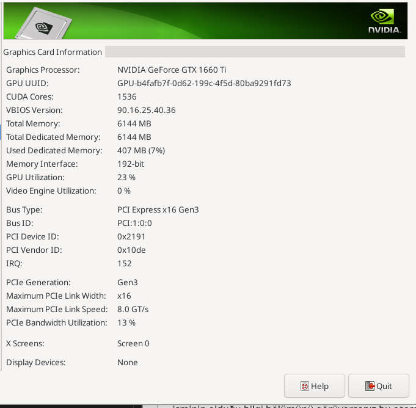

# How To Change Primary Gpu Nvidia in Fedora

(EN)

- First, we do the necessary steps from the link here to install the nvidia driver on our computer (only before step 8)

[Fedora Docs](https://docs.fedoraproject.org/en-US/quick-docs/how-to-set-nvidia-as-primary-gpu-on-optimus-based-laptops/)

(or if you can't do it from this link, I can suggest another source)

[Phoenixnap](https://phoenixnap.com/kb/fedora-nvidia-drivers)


After doing the steps here, after typing "Nvidia" in the search field of your computer, open the "Nvidia X Server settings" application, if you see the information section with the name of your video card in the menu inside the application, the steps up to this stage have been done correctly.



Now we change the primary video card,

First Step : Clone This Repository
```
# git clone https://github.com/geminis3/envycontrol.git
```
Second step : Install the package if not installed
```
$ sudo dnf install python3-pip
```
Third Step :
```
# cd envycontrol
$ sudo pip3 install .
```
Step four : If you were able to successfully install the program
```
$ sudo envycontrol -s nvidia
```

!!! If you have not encountered any problems, after restarting your computer, you should see your video card in the gpu section after typing "screenfetch" (you need to download the package first) in the computer's about app or terminal. !!!

!!! If you use Wayland gnome you change this option => sudo /etc/gdm/custom.conf > WaylandEnable=False !!!

---

(TR)

- Öncelikle nvidia sürücüsünü bilgisayarımıza yüklemek için buradaki bağlantıdan gerekli adımları yapıyoruz (sadece 8. adımdan öncesi)

[Fedora Docs](https://docs.fedoraproject.org/en-US/quick-docs/how-to-set-nvidia-as-primary-gpu-on-optimus-based-laptops/)

(veya bu bağlantıdan yapamıyorsanız, başka bir kaynak önerebilirim)

[Phoenixnap](https://phoenixnap.com/kb/fedora-nvidia-drivers)

Buradaki adımları yaptıktan sonra bilgisayarınızın arama alanına "Nvidia" yazdıktan sonra "Nvidia X Server settings" uygulamasını açın, uygulamanın içindeki menüde ekran kartınızın isminin olduğu bilgi bölümünü görüyorsanız bu aşamaya kadar olan adımlar doğru yapılmış demektir.


Şimdi birincil ekran kartını değiştiriyoruz,

İlk Adım : Bu Repoyu Klonlayın
```
# git clone https://github.com/geminis3/envycontrol.git
```
İkinci adım : Yüklü değilse paketi yükleyin
```
$ sudo dnf install python3-pip
```
Üçüncü Adım :
```
# cd envycontrol
$ sudo pip3 install .
```
Dördüncü adım : Programı başarıyla yükleyebildiyseniz
```
$ sudo envycontrol -s nvidia
```

!!! Eğer herhangi bir sorunla karşılaşmadıysanız bilgisayarınızı yeniden başlattıktan sonra bilgisayarın about uygulamasına veya terminale "screenfetch" (önce paketi indirmeniz gerekiyor) yazdıktan sonra gpu bölümünde ekran kartınızı görmeniz gerekir. !!!

!!! Wayland Gnome kullaniyorsaniz /etc/gdm/custom.conf dosyasindaki WaylandEnable ayarini False yapmaniz gerekiyor !!!

Date : 18/05/2023 | OS : Fedora 38 (XFCE Spin)
